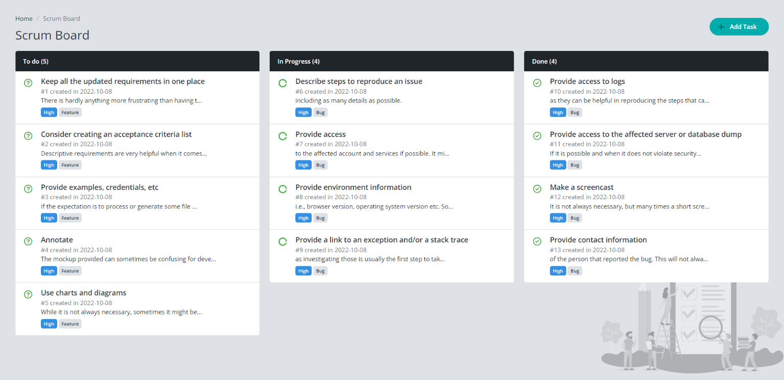
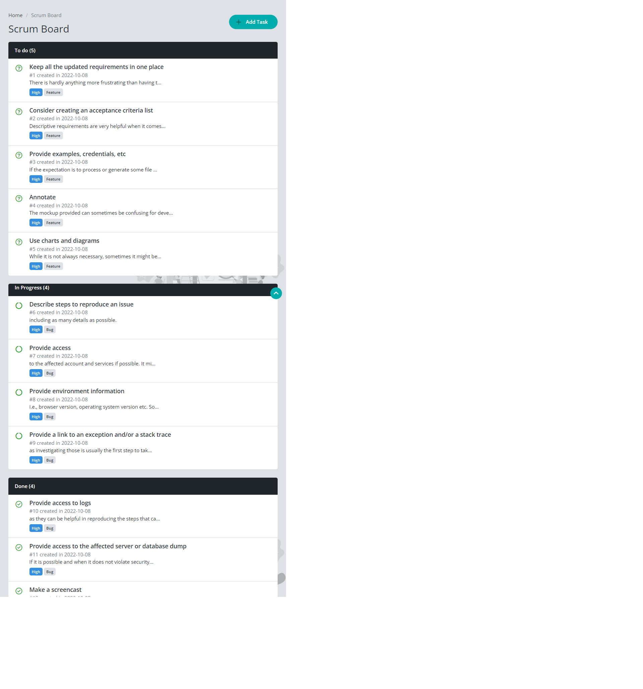
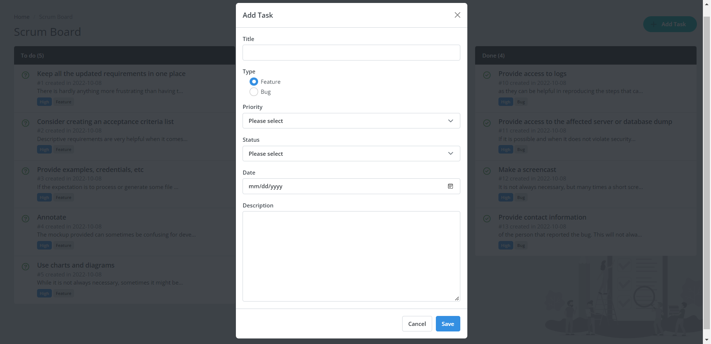

# Projet YouCode Scrum Board

L'objectif était de développer une application web YouCode Scrum Board en utilisant Bootstrap, en la rendant aussi proche que possible de la conception proposée.

## Bienvenue! 👋

Pour développer l'interface de l'application web avec un design responsive, une compréhension de base du HTML, CSS, JavaScript et de la framework CSS Bootstrap a été utilisée. Cette approche facilite le développement et garantit un code source lisible avec les bonnes pratiques de nomination des classes CSS.

## Où tout trouver?

La tâche consistait à construire des wireframes low fidelity et high fidelity du projet à l'aide d'un outil de wireframing - web design, en utilisant les dessins et modèles contenus dans 📁 `/design`. Ces documents comprenaient des versions mobiles et de bureau de la conception.

Les maquettes étaient au format PNG statique, permettant de discerner les styles tels que 'font-size', 'padding' et 'margin', afin de mieux percevoir les différences d'espacement et de taille.

Le fichier HTML principal, `index.html`, a été préparé pour l'ajout des classes CSS de Bootstrap 5. Les ajustements CSS supplémentaires ont été gérés dans le fichier `style.css` situé dans 📁 `/assets/css`. JavaScript a été utilisé pour ajouter des fonctionnalités dynamiques telles que la gestion des événements et la manipulation du DOM.

## Construction du projet

Le projet a suivi un flux de travail structuré pour garantir une efficacité maximale. Voici les étapes suivies :

1. Initialisation du projet en tant que dépôt public sur [GitHub](https://github.com/).
2. Configuration du repository pour publier le code sur une URL, utilisant différentes méthodes de déploiement.
3. Création d'un projet à l'aide d'un outil de wireframing - web design, avec exportation du livrable en format PDF dans un 📁 nommé `/mockup` en l'absence de l'utilisation de Figma ou Adobe XD.
4. Analyse des modèles pour planifier l'approche du projet, anticipant les classes CSS réutilisables de Bootstrap.
5. Structuration du contenu HTML avant l'ajout des classes CSS et des styles, facilitant la concentration sur l'apprentissage et l'application de plusieurs composants bien structurés.
6. Intégration d'un composant modal ou popup, comme illustré dans la section Modal preview.
7. Implémentation d'une modale contenant un formulaire permettant d'ajouter une nouvelle tâche (**`Title`**, Type (**`Feature`** ou **`Bug`**), **`Priority`** (**`Low`**, **`Medium`**, **`High`**, **`Critical`**), Status (**`To Do`**, **`In Progress`**, **`Done`**), **`Date`** et **`Description`**) lorsque l'utilisateur clique sur le bouton `Add Task`.

JavaScript a été crucial pour ajouter des fonctionnalités dynamiques, comme la gestion des événements, la manipulation du DOM, la validation des formulaires, et l'interaction avec localStorage pour stocker les données de manière persistante.

## Layout

Les designs ont été créés dans les largeurs suivantes :
- Mobile: **375px**
- Desktop: **1440px**

Les maquettes en format PNG se trouvent dans 📁 `/design`.

## Preview

### Desktop preview

---
### Mobile preview

---
### Modal preview

---

Merci et bonne chance! 🚀
